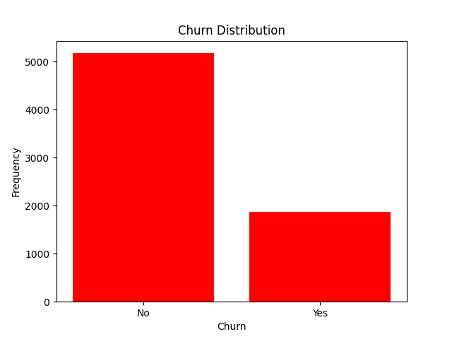
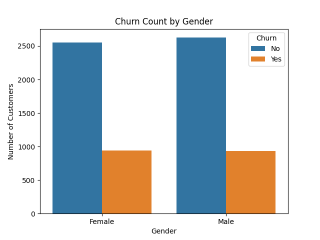
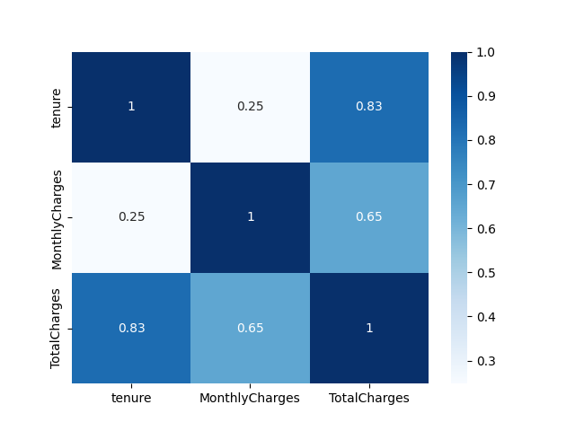
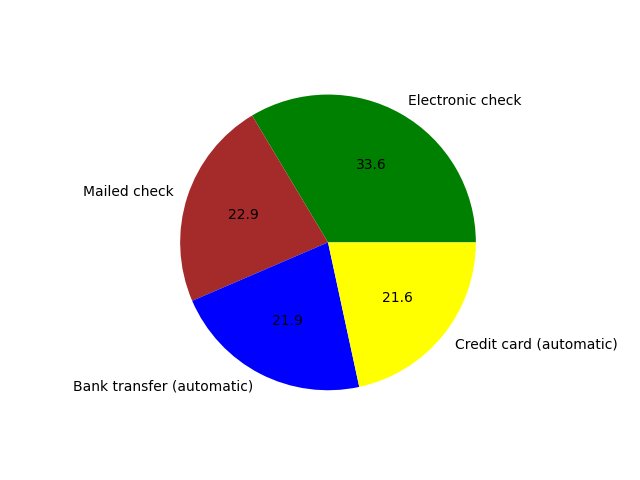
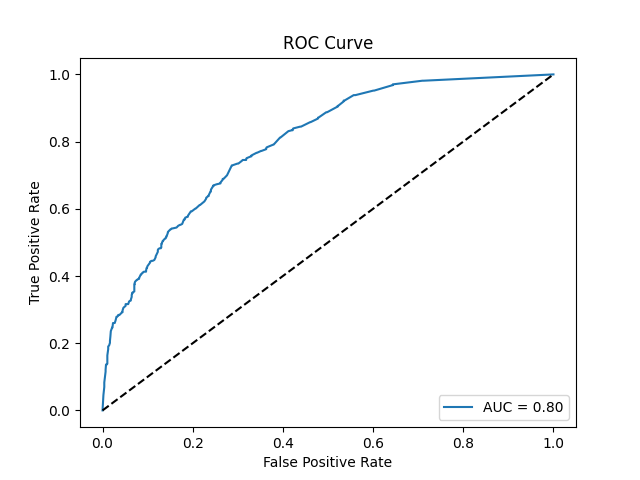

# Customer Churn Prediction

This project predicts whether a telecom customer will churn based on:
- Monthly Charges
- Tenure (in months)
- Number of Support Calls
- Contract Type (Month-to-month, One year, Two year)
---

🚀 **Try the App:**  
👉 [Click here to open the Streamlit App](https://random-forest-and-naive-bayes---customer-churn-ah3bmyukyky8gzm.streamlit.app/)

---
## How to Run

1. Install dependencies:
   pip install streamlit pandas scikit-learn

2. Run the app:
   streamlit run app.py

## Files Used

- app.py → Streamlit application
- model.pkl → Trained Random Forest model
- WA_Fn-UseC_-Telco-Customer-Churn.csv → Original dataset
- plots/ → Visualizations used for analysis

## Visualizations

### 1. Churn Distribution  

Shows the number of customers who churned vs. those who stayed. Useful to understand class imbalance.

---

### 2. Churn by Gender  

Compares churn rates across male and female customers to detect any gender-based trends.

---

### 3. Feature Correlation Heatmap  

Shows correlation between numerical features like tenure, monthly charges, etc.

---

### 4. Payment Method Pie Chart  

Displays the proportion of different payment methods used by customers.

---

### 5. ROC Curve  

Visualizes model performance. AUC score shows how well churn is predicted.

## Conclusion

This project demonstrates an end-to-end **churn prediction pipeline** using a Random Forest Classifier.  
The Streamlit app allows users to input customer details and get real-time predictions, while the visualizations provide insight into churn behavior.  
It can help telecom providers identify and retain customers who are likely to churn.

---
